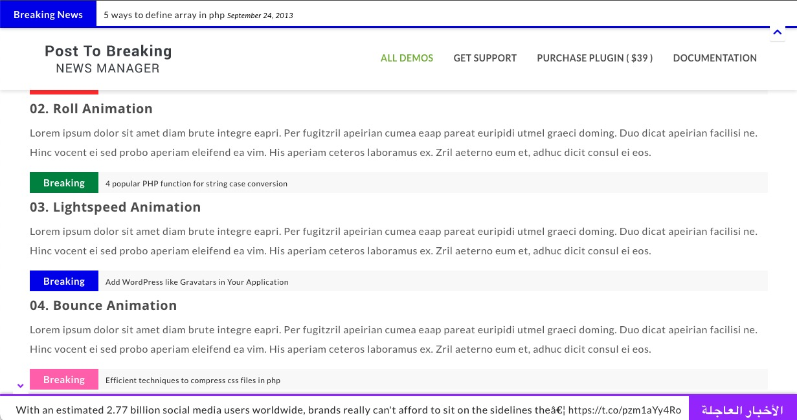
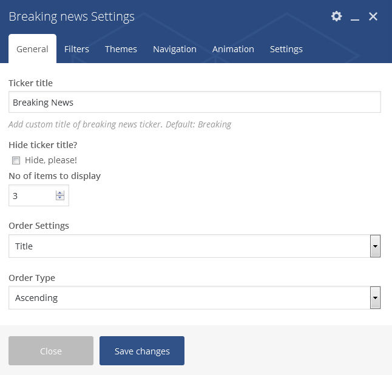
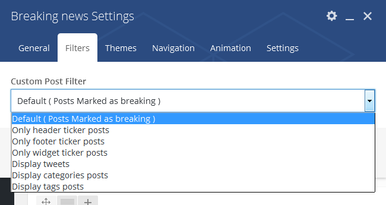
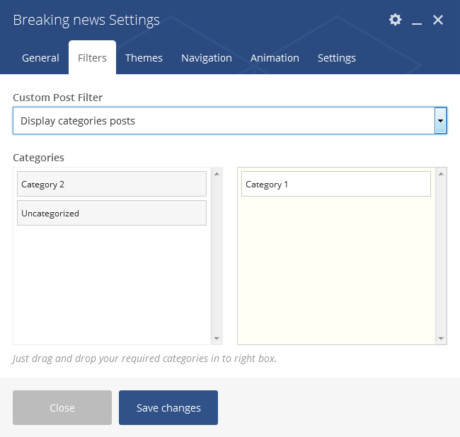
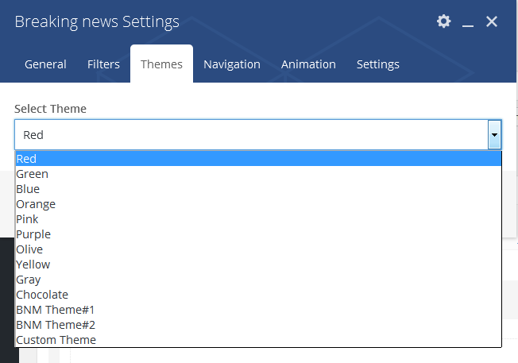
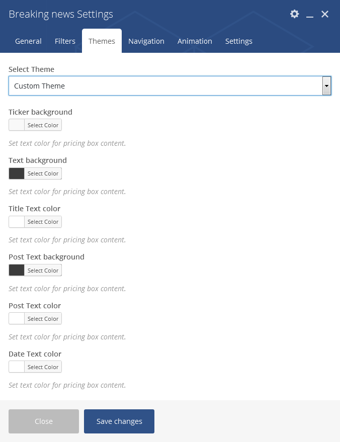
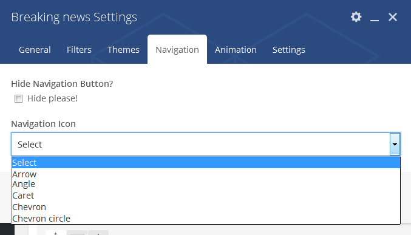
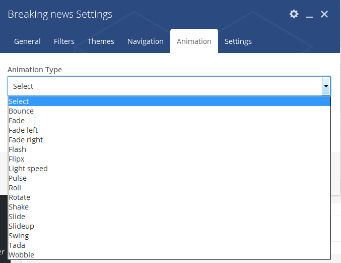
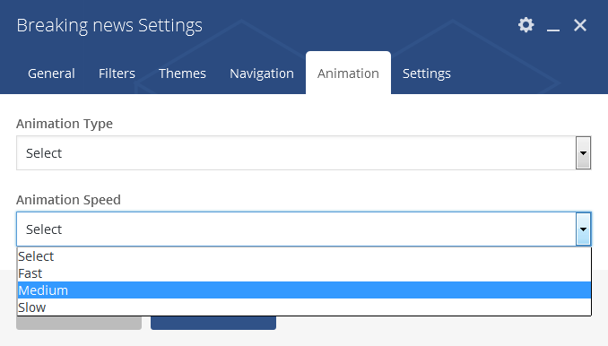
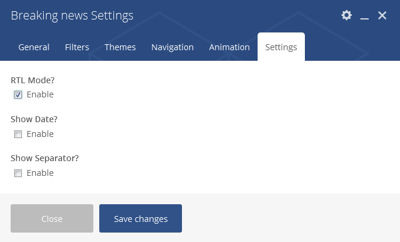

## Breaking News Addon For WP Bakery Page Builder

Easy & powerful breaking news addon for WP Bakery Page Builder that allows you to create an animated breaking news ticker for your site within a few minutes. Addon comes with 11 predefined themes with a custom theme builder and 16 smooth news ticker animation features. So, you can create an eye-catching breaking news ticker for your site requirements.

[Demo](https://projects.bluewindlab.net/wpplugin/bnm/) |
[Download](https://bluewindlab.net/portfolio/breaking-news-addon-for-wp-bakery-page-builder/) |
[Documentation](https://xenioushk.github.io/docs-plugins-addon/bnm-addon/index.html)

## Addon Requirements

You need to install [BWL Breaking News Manager Plugin](https://1.envato.market/bnm-wp) to use the addon.

You need at least WordPress version 4.8+ installed for this plugin to work properly. It is strongly recommended that you always use the latest version of WordPress to ensure all known bugs and security issues are fixed.

## Addon Features

- Display breaking news any where of site.
- Easy to use and flexible customization feature.
- Custom breaking news block for visual composer.
- 16 smooth news ticker animation.
- 11 predefined theme with custom theme builder.
- 7 custom ticker navigation button.
- RTL supported news ticker.
- Responsive ticker layout.
- Custom ticker filter.
- Ready for localization.
- Front end editing with Visual Composer.
- Quick installation and super easy to use.
- Extensive Documentation.
- 6 Months premium support & Free Lifetime updates.

## Breaking News Addon Blocks

### General Block

### Filter Block

### Category Filter Block

### Theme Block

### Custom Theme Block

### Navigation Block

### Animation Block

### Animation interval Block

### Settings Block

## Technical Requirements

- WordPress 5.6 or greater.
- PHP version 7.4 or greater.
- MySQL version 5.5.51 or greater.

### Acknowledgement

- [bluewindlab.net](https://bluewindlab.net)
